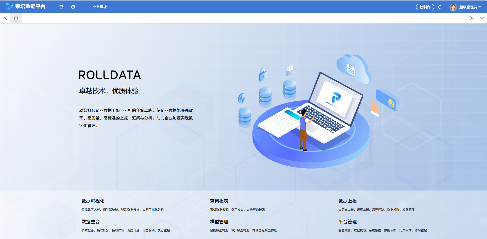
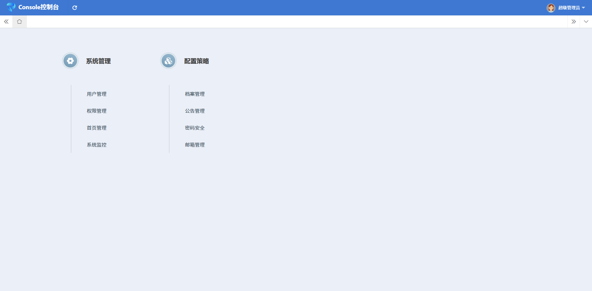
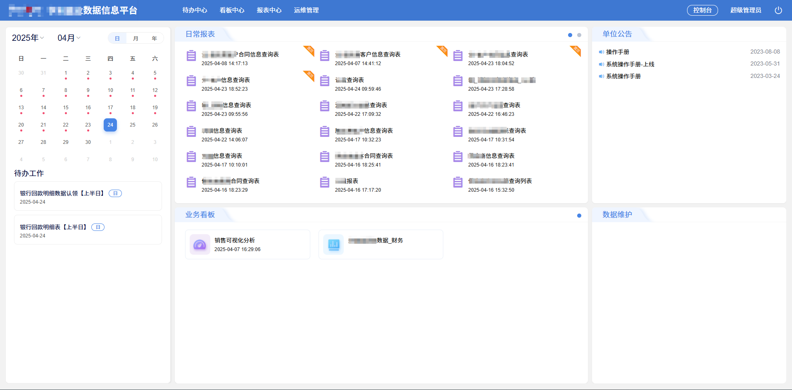
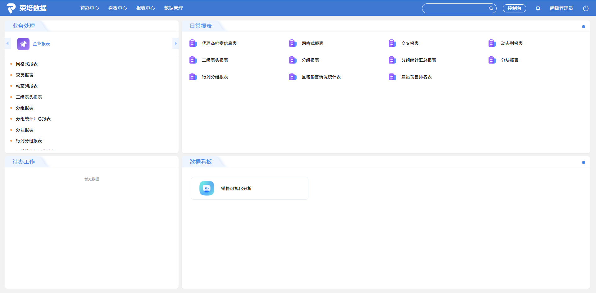
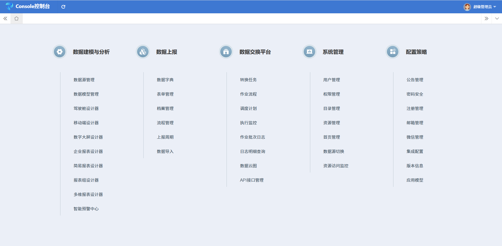
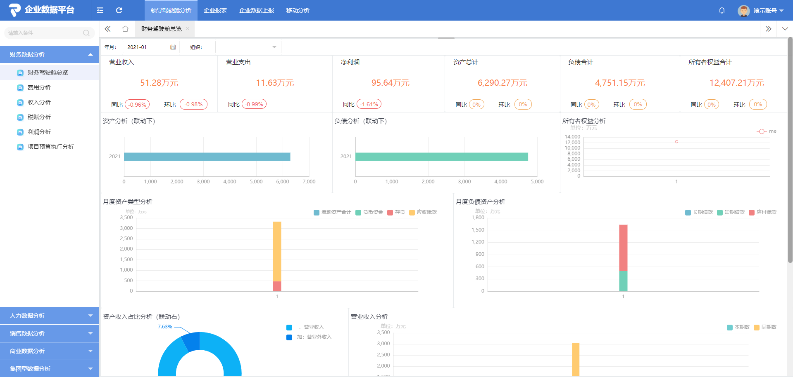
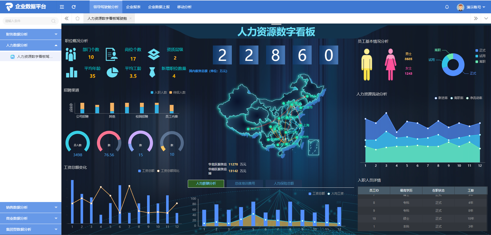
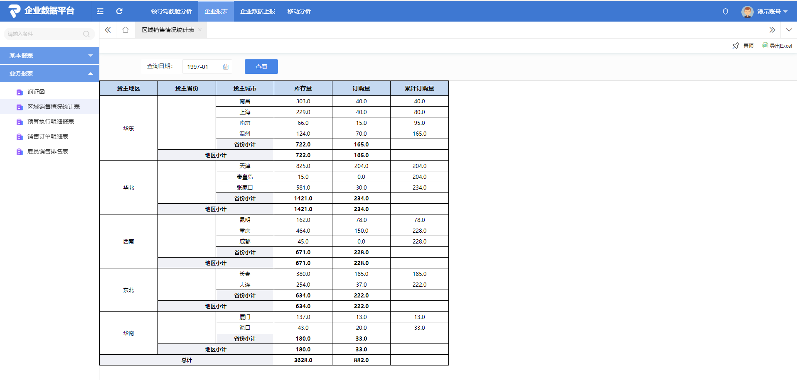

# 荣培数据基础运行平台

#### 介绍

- 荣培数据基础运行平台是一个快速开发平台，也是二次开发模块集成入荣培数据企业版的开发框架。该开源项目作为企业级快速开发解决方案，后端基于经典三层架构SSH（Spring、SpringMVC、Hibernate）等，前端采用LayUI、jQuery、原生js等，这套组合，虽不是最新的技术栈，也不是前后分离，核心框架用的版本均是jdk1.8内最新版本，其稳定性高，分层设计：使用分层设计，分为dao，service，Controller，view层，层次清楚，低耦合，高内聚。方便部署，适合初、中级全栈工程师一体化开发，简单易配，节省人力成本，缩短项目周期，不管是做项目、学习、接私活它都将是你的最佳拍档。

- 平台采用多数据源模式，druid连接池，ORM采用的SpringDataJPA，可免去写一些sql，方便适配不同的数据库，支持多种数据库MySQL, Oracle, sqlserver等，也支持国产库，预置有达梦DM8的jar包。

- 荣培数据基础运行平台核心功能模块有：组织机构、用户、角色、职务、权限管理（目录菜单及按钮权限、数据权限）、首页管理、系统监控、档案管理、公告管理、密码安全、邮箱管理等，扩展功能有：单点登录、国际化、定时任务等。

    
- 本平台安全方面，包含了XSS过滤，防sql、js注入，可配置的页面集成禁止跨域访问等，密码md5加密存储，登陆密码加密传输，用户密码强破保护，密码位数、复杂度、错误次数、开启验证码等配置。采用Shiro管理菜单目录和按钮权限。


- 平台页面区分前台和后台管理，通过角色类型区分，这样可以更方便区分前台使用人员，后台运维人员。

- 部署方面，默认可以用tomcat部署，也可以打成war包部署其他中间件，当然，java环境，jvm运行，理论跟操作系统关系不大，有Linux的jdk，也就支持国产操作系统。

- 后续计划：
    后续会有Springboot版，Spring Cloud版本，也希望有感兴趣的进行贡献，共创方便使用的快速开发平台。
- 在线体验：
 **[demo演示](http://www.wrenchdata.com:8082/)** <br>体验用户，通过 **[注册](http://www.wrenchdata.com/trialUser)** 用户，或 体验用户：demo，密码：demo
- 企业版下载：**[下载](http://www.wrenchdata.com/product/Download/)**
- 源码仓库地址： **[Gitee](https://gitee.com/rolldata/rolldata-open/)** 、**[GitCode](https://gitcode.com/rolldata/rolldata-open/)** 、**[GitHub](https://github.com/rolldata/rolldata-open/)**
- 官方网站：**[官网](http://www.wrenchdata.com)**
- 使用文档：**[在线帮助](http://help.wrenchdata.com/index-0001.html)**
- 交流社区：**[社区问答](http://help.wrenchdata.com)**

平台企业版已应用于各行业的大中小项目中，以下是各版本功能对比：

| 功能描述 | 开源版 | 社区免费版 | ETL版 | 报表版 | 可视化版 | 数据上报版 | 标准版 | 企业版 |
|---|---|---|---|---|---|---|---|---|
| 企业门户 | √ | √ | √ | √ | √ | √ | √ | √ |
| 组织管理 | √ | √ | √ | √ | √ | √ | √ | √ |
| 用户管理 | √ | √ | √ | √ | √ | √ | √ | √ |
| 权限管理 | √ | √ | √ | √ | √ | √ | √ | √ |
| 首页管理 | √ | √ | √ | √ | √ | √ | √ | √ |
| 公告管理 | √ | √ | √ | √ | √ | √ | √ | √ |
| 密码安全 | √ | √ | √ | √ | √ | √ | √ | √ |
| 邮箱管理 | √ | √ | √ | √ | √ | √ | √ | √ |
| 数据源管理 | × | √ | √ | √ | √ | √ | √ | √ |
| 数据模型管理 | × | √ | √ | √ | √ | √ | √ | √ |
| 目录和资源管理 | × | √ | √ | √ | √ | √ | √ | √ |
| 报表设计器 | × | √ | × | √ | × | × | √ | √ |
| 列式报表设计器 | × | √ | × | √ | × | × | √ | √ |
| 多维报表设计器 | × | √ | × | √ | × | × | √ | √ |
| 报表组设计器 | × | √ | × | √ | × | × | √ | √ |
| 驾驶舱设计器 | × | √ | × | × | √ | × | √ | √ |
| 数字大屏设计器 | × | √ | × | × | √ | × | √ | √ |
| 移动端设计器 | × | √ | × | × | × | × | √ | √ |
| 数据上报模块<br>（表单设计器、档案管理、<br>流程管理、数据字典管理） | × | √ | × | × | × | × | √ | √ |
| 数据交换平台（DB版）<br>（抽取任务、抽取作业、<br>调度计划、抽取日志管理） | × | √ | √ | × | × | × | √ | √ |
| 数据交换平台（API版）<br>（API接口管理、<br>API抽取任务、API数据推送） | × | √ | √ | × | × | × | √ | √ |
| 智能预警中心 | × | √ | × | × | × | × | √ | √ |
| 资源访问监控 | × | √ | × | √ | √ | √ | √ | √ |
| 在线用户数 | 不限 | 2个 | 不限 | 不限 | 不限 | 不限 | 不限 | 不限 |
| 上报组织数 | × | 2家 | × | 1家 | × | 5家<br>（更多数量联系商务） | × | 25家<br>（更多数量联系商务） |
| 报表许可数量 | × | 5张 | × | 不限 | × | × | 10张 | 不限 |
| 可视化看板许可数量 | × | 2个 | × | × | 不限 | × | 4个 | 不限 |
| 抽取任务创建数量 | × | 10个 | 不限 | 不限 | × | × | 不限 | 不限 |

#### 平台功能
- 组织机构：配置系统组织机构（公司、部门），树结构展现支持数据权限。
- 用户管理：用户是系统操作者，该功能主要完成系统用户配置，用户所属公司部门，所在职务。
- 权限管理：角色菜单权限分配、设置角色按机构进行数据范围权限划分；职务权限分配、设置职务按机构进行数据范围权限划分。
- 档案管理：对系统中经常使用的一些较为固定的数据进行维护。
- 公告管理：系统通知公告信息发布维护。
- 首页管理：可配置登录页标题、logo、背景图，系统名，系统logo，门户类型。
- 密码安全：配置系统中密码长度，复杂度，期限，错误次数等。
- 系统监控：监视当前系统CPU、内存、磁盘、堆栈等相关信息。
- 邮箱管理：配置系统的发件人，可结合消息推送，定时任务触发发送邮件。

#### 技术选型

1.  后台：
- 核心框架：Spring 、SpringMVC、SpringDataJpa
- 安全框架：Apache Shiro
- 任务调度：Quartz
- 持久层框架：Hibernate
- 数据库连接池：Alibaba Druid
- 缓存框架：Ehcache
- 日志管理：SLF4J、Log4j
- 并发框架：Disruptor
- 工具类：Apache Commons、Jackson、hutool、poi、easyexcel
2.  前台：
- 核心框架：LayUI
- JS框架：jQuery
- 树结构控件：jQuery zTree
- 数据表格：treeGrid

#### 系统截图
- 开源版

登陆页

平台前台用户主页

后台管理控制台页面

- 其他版本

办公门户主页

多功能门户主页

全功能模块控制台

数据分析demo1

数据分析demo2

企业报表demo1

数据上报demo1


#### 使用配置说明

默认使用mysql库，sql路径rollData-ui/resources/sql<br>
要求JDK1.8+<br>
导入项目到Idea(项目目前使用分模块开发，我们建议是用IDEA开发).<br>
修改数据库配置文件dbconfig.properties中的用户密码.<br>
启动项目，管理员账号admin/密码123456，管理员默认所有目录和按钮权限<br>
角色分为2种，一种普通角色，只看一些前台的业务功能模块，另一种是管理角色，即可以看到控制台的一些管理配置

#### 代码示例
参考rollData-business模块<br>
目录菜单维护，后台库表wd_sys_function维护系统菜单目录，字段is_admin配置，0前台目录菜单，1后台管理目录菜单，字段power_flag配置后台代码Shiro过滤权限标记<br>
如：<br>
```INSERT INTO wd_sys_function (id, func_name, parent_id, href_link, sort, state, c_type, relation_id, is_href, is_system, power_flag, c_system_type, terminal_pc, terminal_ipad,terminal_mobile, icon_class, create_time, create_user, update_time, update_user, is_admin, wd_model_id, business_type) VALUES('2c9a20819623008601962304ed890004', 'demo管理','2c9a20819623008601962304ed890003', 'businessController/demoManage', 1, '1', '0', NULL, NULL, '0', 'sys:business:demoManage', 'business', NULL, NULL, NULL, 'iconfont icon-peizhi', '2025-04-01 00:00:00.0', '4028b88163953a1b01639563f09c0005', NULL, NULL, '0', NULL, NULL);```

目录菜单按钮维护，页面中涉及到按钮操作的均可配置，后台库表wd_sys_function_oper，同样字段power_flag配置后台代码Shiro过滤权限标记<br>
如：<br>
```INSERT INTO wd_sys_function_oper (id, func_id, oper_name, power_flag, create_time) VALUES('4028b881zxcda6f201647daa234xf223', '2c9a20819623008601962304ed890004', '查询','sys:business:query', '2025-04-15 18:44:11.0');```

后台权限标识均放到controller层
    
```
@Controller
@RequestMapping("/businessController")
@RequiresPathPermission("sys:business")
public class BusinessController {
}
```
@RequiresPathPermission标签配置权限前缀，具体页面及按钮通过@RequiresMethodPermissions标签

```
@RequiresMethodPermissions(value = "demoManage")
@RequestMapping(value = "/demoManage")
public ModelAndView demoManage(HttpServletRequest request, HttpServletResponse response) {
    return new ModelAndView("web/business/demoList");
}
```

事务默认均service层

如果是二开的，模块打成jar包，放入荣培数据企业版webapps\ROOT\WEB-INF\lib下，跟随启动即可

#### 平台目录结构说明
    rollData_open
    rollData-core	核心模块
        core	核心代码
        web 	web业务
            common	公共
            message	消息
            system	系统相关			
    rollData-web	web业务模块
        rollData-business	业务模块（可自行仿照新建其他业务模块）
            web		web业务
                business	业务包（可自行仿照新建其他业务包）
        rollData-common     公共模块
            web		web业务
                system	系统相关		
        rollData-ui		UI模块
            resources	资源
                i18n	国际化
                sql		初始化sql文件
                webapp      web页面相关
                static      静态资源
                template	模版文件下载目录
                uploadFile	上传文件存放目录
                webpage     页面

#### 技术交流
- 官方网站：**[官网](http://www.wrenchdata.com)**
- 使用文档：**[在线帮助](http://help.wrenchdata.com/index-0001.html)**
- 交流社区：**[社区问答](http://help.wrenchdata.com)**
- 联系我们：商务咨询 微信和手机号 ：13521751283<br>

- QQ群：690722171<br>

